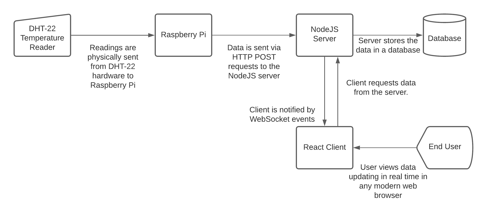

# Measurement & Transmission of Temperature Data with Raspberry Pi, Python, NodeJS, REST, and WebSocket

By Jack Hermanson and Dallin Casey, 2021

## Abstract

Fill this in later.

## Introduction

Our project consists of 3 core parts: the Raspberry Pi, the NodeJS server, and the React front end. 

The Raspberry Pi uses a sensor called DHT-22 to read temperature data when prompted by a Python program. That Python program then sends the data its gathered over the Internet to a web server using an HTTP `POST` request. 

When the server receives that HTTP request, it 1) stores that data in the database, and 2) notifies the front end that it has received new data via a websocket connection. 

When the front end is notified that new data has been received by the server, it initiates an HTTP `GET` request that fetches the information stored in the database. This allows the user to continuously receive up-to-date information without having to refresh their browser or restart any programs.

## Problem Characterization

## Proposed Solution and Implementation Strategy

## Conclusions

## Bibliography